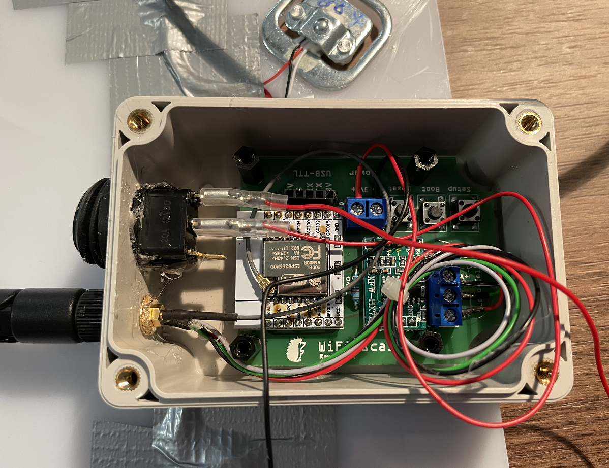

# WiFi Waage für Igelfutterhaus

Inspiration: https://beelogger.de/sensoren/waegzellen_hx711/

Ähnliche Projekte im Internet

-   <https://www.instructables.com/Wi-Fi-Smart-Scale-with-ESP8266-Arduino-IDE-Adafrui/>

-   <https://how2electronics.com/iot-weighing-scale-hx711-load-cell-esp8266/>

# Vorbereitung

## Komponenten

-   Hardware

    -   ESP8266 möglichst minimal (ideal ESP-07S), am besten mit
        externer Antenne

    -   AD-Wandler für Waage: HX711

    -   Wägezellen

    -   Sonstiges

        -   Platte für den Aufbau der Wägezellen

        -   Elektronikbox

        -   Batteriehalter und Batterie

        -   Schalter

        -   Kabel und Anschlussbuchsen

-   Software

    -   Arduino IDE, [Arduino -
        Software](https://www.arduino.cc/en/Main/Software_)

    -   Serieller Treiber

        -   Für D1 Mini NodeMCU:
            <https://github.com/nodemcu/nodemcu-devkit/tree/master/Drivers>

        -   Siehe auch
            <https://tttapa.github.io/ESP8266/Chap03%20-%20Software.html>

    -   HX711 Treiber: <https://github.com/bogde/HX711>

### ESP 8266 07-S

Für den Batteriebetrieb bietet sich ein möglichst minimal bestückter
Controller (ESP8266) an. Ich habe diesen hier verwendet (Bezeichnung
ESP8266 **ESP-07S**):

[ZHITING ESP8266 Seriell zu WiFi-Funkmodul
ESP-07S](https://www.amazon.de/gp/product/B085B21DMB/ref=ppx_yo_dt_b_asin_title_o01_s00?ie=UTF8&psc=1)

Um den Controller nutzen zu können, sollte dieser auf eine Platine
aufgelötet werden (SMD-Löten). Hier eignet sich diese Platine:

[AZDelivery 3 x Adapter Board Platte für ESP8266 ESP8266-12E / 12F,
ESP-07 und
ESP-08](https://www.amazon.de/gp/product/B071YQPLWH/ref=ppx_yo_dt_b_asin_title_o02_s00?ie=UTF8&th=1)

Als Antenne habe ich diese genutzt:

[Bingfu RP-SMA WiFi Antenne 8 dBi 2,4/5/5,8 GHz, und 15cm IPEX IPX U.FL
auf RP-SMA-Buchse Kabel Kompatibel mit Intel Fenvi HP Dell Wireless
Mini-PCI Express PCIE-Netzwerkkarte WiFi-Adapter, 2
Stück](https://www.amazon.de/gp/product/B095KVPS34/ref=ppx_yo_dt_b_asin_title_o06_s00?ie=UTF8&psc=1)

### USB zu TTL Adapter

Für den Anschluss und die Programmierung ist ein USB zu TTL Adapter
erforderlich, z.B.

[AZDelivery 3 x CP2102 USB zu TTL Konverter HW-598 für 3,3V und
5V](https://www.amazon.de/gp/product/B07N2YLH26/ref=ppx_yo_dt_b_asin_title_o03_s00?ie=UTF8&psc=1)

Wichtig ist hier auf den Chipsatz zu achten, in diesem Fall ein CP2102.
Je nach Chipsatz sind unterschiedliche Treiber erforderlich (siehe
Abschnitt 1.2).

### AD Wandler HX711

Der AD-Wandler HX711 kann z.B. hier bestellt werden.

[Innovateking-EU 6 Stücke HX711 Wägezelle Gewicht Sensor Modul 24-Bit
Präzision AD Modul Dual-Kanal für Arduino
Waage](https://www.amazon.de/gp/product/B07TWLP3X8/ref=ppx_yo_dt_b_asin_title_o06_s00?ie=UTF8&psc=1)

### Ladezellen

Als Waage habe ich diese hier bestellt:

[YOUMILE 4er Pack DIY 110lbs 50KG Halbbrücken Wägezelle Gewicht
Dehnungssensor Widerstand + HX711 AD
Modul](https://www.amazon.de/gp/product/B07TWLP3X8/ref=ppx_yo_dt_b_asin_title_o06_s00?ie=UTF8&psc=1)

Hier ist auch direkt ein HX711 Modul enthalten, allerdings war mir hier
die Platine zu groß. Die Platine aus Abschnitt 1.1.3 ist deutlich
kleiner.

### Batterie und Batteriehalter

Als Batterie kommt eine Batterie **LiFePo** 18650 (3,2 V) zum Einsatz
(Achtung: kein Lithium Ionen Akku keine NiMH-Akkus!), z.B.

[4 Stück HAKADI 3.2V LiFePo4 Akku 1500mAh Mit 3000+ Zyklen Lebensdauer
wiederaufladbare Lithium Eisenphosphat Batterien 3C-5C Entladung für
Taschenlampen,
Elektroroller](https://www.amazon.de/gp/product/B09J4N36WT/ref=ppx_yo_dt_b_search_asin_title?ie=UTF8&th=1)

Ein entsprechendes Batteriefach wird auch benötigt, z.B.

[2 Stück 18650 Einzelbatteriehalter, 1 Steckplatz, schwarzer
Verriegelungsfederbatteriehalter](https://www.amazon.de/gp/product/B08K32JPZW/ref=ppx_yo_dt_b_asin_title_o05_s00?ie=UTF8&psc=1)

Alternativ kann ein Halter für 2 Batterien genutzt werden. Die Batterien
müssen dann parallel (nicht in Reihe!!!) geschaltet werden, z.B.:

[sourcing map Batteriefach Aufbewahrungsbox 2 Steckplätze x 3,7 V
Batteriehalter für 2 x 18650 Batterie 2
Stück](https://www.amazon.de/gp/product/B095KVPS34/ref=ppx_yo_dt_b_asin_title_o06_s00?ie=UTF8&psc=1)

Hier müssen beide Batterien in der gleichen Orientierung eingelegt und
die Anschlüsse jeweils auf Kopf- und Fußseite verbunden werden. Achtung:
Im Fach ist selbst eine Polung angegeben (gedreht). Diese kann man auch
nutzen, dann müssen die Anschlüsse aber über Kreuz abgeleitet werden
(beide Pluspole zusammen, beide Minuspole zusammen). Am Ende darf auch
bei zwei Batterien die Spannung nur 3,2V betragen (direkt nach dem
Aufladen kann sie etwas höher sein, aber bei 6V liegen die Zellen in
Reihe, was den ESP zerstören würde).

### Wasserdichte Elektronikdose

Ich habe diese Dose verwendet:

[Kunststoffgehäuse IP66 ABS Plastik Elektronische Gehäuse Box
Anschlußdose Wasserdicht Schaltschränke Stromverteilung Zählerkasten
Leergehäuse Kunststoff
(100x68x50mm)](https://www.amazon.de/gp/product/B07LF6TMLD/ref=ppx_yo_dt_b_asin_title_o01_s00?ie=UTF8&th=1)

### Sonstiges

Für den Schalter habe ich dieses Set genutzt:

[APIELE 5 Stücke Wasserdichter runde Kippschalter,2 Position EIN-Aus mit
LED-Schalter SPST 3 Pins Wippschalter,12V 20A Taste Rocker Kippschalter
Für Auto, Boot, Haushaltsgeräte KCD1-8-101NW
(grün)](https://www.amazon.de/gp/product/B08LKSYSRP/ref=ppx_yo_dt_b_asin_title_o04_s00?ie=UTF8&th=1)

### Platine

Die Platine kann mit einem PCB Tool wie Fritzing erstellt werden:

Bei Aisler.net sieht die Platine so aus (Oberseite):

Hinweis: Das schöne Bild mit dem Igel ist urheberrechtlich geschützt. Es kann [hier bei Etsy](https://www.etsy.com/de/listing/661210954/igel-einzigartige-tier-datei-svg-ai-dxf) gekauft werden. In der Platine, die hier im Ordner abgelegt ist, ist das Bild nicht enthalten.

Die fertig bestückte Platine:

Und so sieht das dann in der Elektronikbox aus.

## Seriellen Treiber installieren

Der Serielle Treiber richtet sich nach dem USB zu TTL Adapter bzw. bei
Boards bei denen dieser integriert ist (USB-Anschluss auf dem Board,
z.B. NodeMCU) nach dem Board.

### CP2102 USB zu TTL Adapter oder Wemos D1 Mini

Der Treiber kann hier heruntergeladen werden:\
<https://www.silabs.com/developers/usb-to-uart-bridge-vcp-drivers>

Treiber ist CP210x Windows Driver, nicht CP210x Universal Windows Driver

Nach dem Download die ZIP-Datei entpacken und die INF-Datei installieren
(Kontextmenü):

Den genutzten Port (virtueller COM-Anschluss) sieht man im
Gerätemanager. Hier z.B. COM4. Dieser Port muss dann in der Arduino IDE
ausgewählt werden.

### D1 Wemos NodeMCU (aufgedruckte WLAN Antenne)

Der Treiber kann hier heruntergeladen werden:

<https://tttapa.github.io/ESP8266/Chap03%20-%20Software.html>

Der Download-Link für die NodeMCU Boards verweist auf:

<https://github.com/nodemcu/nodemcu-devkit/tree/master/Drivers>

Hier die Windows-Version herunterladen, entpacken und starten.

**Der Microcontroller dafür bereits vor der Installation per USB
angeschließen!**

**Wenn das Board bei der Installation nicht über das serielle Kabel
angeschlossen war (oder das Kabel defekt ist bzw. kein Datenkabel war)
kommt die Meldung, dass der Treiber vorläufig installiert wurde.**

**Also: Board vor der Installation anschließen**

Den genutzten Port (virtuelle COM-Schnittstellen), sieht man im
Gerätemanager. Hier ist es COM3.

Dieser Port muss in der Arduino IDE eingestellt werden.

## Arduino IDE einrichten

Arduino IDE installieren.

ESP8266 Core Version 2.0 für Arduino installieren.

Siehe z.B.

-   <https://circuitjournal.com/esp8266-with-arduino-ide>

-   [GitHub - esp8266/Arduino: ESP8266 core for
    Arduino](https://github.com/esp8266/Arduino)

Hier findet sich auch die Dokumentation des Arduino Cores:

[GitHub - esp8266/Arduino: ESP8266 core for
Arduino](https://github.com/esp8266/Arduino)

Unter Datei/Voreinstellungen die URL in das Feld "Zusätzliche
Boardverwalter-URLs" eintragen und dann auf ok klicken.

https://arduino.esp8266.com/stable/package_esp8266com_index.json

Dann unter Werkzeuge/Boardverwalter über das Suchfeld "esp8266" die
"eps8266" Boards hinzufügen:

Anschließend das Board auswählen unter Werkzeuge/Board: "Name"/ESP8266
Boards.

Ja nach verwendetem Board kommen unterschiedliche Einstellungen zur
Anwendung.

  -------------------------------------------------------------------------------------------------------------------------
  ESP-07S                                                           NodeMCU
  ----------------------------------------------------------------- -------------------------------------------------------
  
  Beschreibung](./media/image24.png)  

  -------------------------------------------------------------------------------------------------------------------------

Diese Einstellungen erreicht man über das Werkzeuge-Menü:

Im Menü "Werkzeuge" können weitere Einstellungen für das Board
vorgenommen werden. Wichtig ist die Port-Einstellung (gemäß dem Port,
den der serielle USB Treiber nutzt).

Ist „Port" ausgegraut (wie hier im Screenshot) funktioniert der Treiber
noch nicht (siehe Abschnitt 1.2) oder es ist kein Gerät angeschlossen.

Ein möglicher Fehler ist auch, dass das Micro-USB Kabel nicht geeignet
ist (es muss ein Datenkabel sein und nicht nur die Leitungen zum Laden
haben).

Mit installiertem Treiber kann auch der Port gewählt in der Arduino IDE
gewählt werden:

Der Port muss durch Auswahl einmal gewählt werden. Solange dort „Port"
steht, ist noch kein Port gesetzt. Danach sollte das so aussehen:

Der serielle Monitor findet sich unter Werkzeuge/Serieller Monitor. Hier
muss die richtige Baud-Zahl eingetragen (identisch mit dem
Serial.begin-Wert im Code), bei mir 115200.

## Bibliothek HX711 installieren

Die HX711 Bibliothek, die ich genutzt haben, findet sich hier:

<https://github.com/bogde/HX711>

Sie kann einfach über die Bibliotheksverwaltung der IDE installiert
werden.

# Hardware zusammensetzen

## Waage aufbauen / HX711 anschließen

Die vier Pads müssen nach diesem Muster verschaltet werden:

# Fritz!Box als Zeit- FTP Server

## Zeitserver

Im Menü Heimnetz, den Punkt Netzwerk auswählen, dann Reiter
Netzwerkeinstellungen und ganz nach unten scrollen. Den Bereich „weitere
Einstellungen" aufklappen. Dort kann das Häkchen gesetzt werden bei
„FRITZ!Box als Zeitserver im Heimnetz bereitstellen".

## FTP

Zuerst ein Verzeichnis anlegen. Am einfachsten geht das mit dem
FRITZ!NAS Client:

Ich habe ein Verzeichnis wifiwaage auf dem USB Stick angelegt. Darunter
am besten direkt ein Verzeichnis log, in das die Wiegeprotokolle
geschrieben werden.

Dann in der FRITZ!Box Oberfläche auf System, FRITZ!Box-Benutzer klicken
und einen neuen Benutzer anlegen.

**Hinweis**: Es empfiehlt sich zwei getrennte Benutzer einzurichten,
einen für die Waage (Übertragung der Wiegedaten) und einen zum Auslesen.
Ansonsten hatte ich das Problem, dass es Schreibfehler gibt, wenn die
Waage übertragen will und gleichzeitig der Benutzer zum Lesen eingeloggt
ist.

Name: wifiwaage

Passwort: bella123

Bei Berechtigungen das Häkchen bei „Zugang zu NAS-Inhalten" setzen.

In dem dann aufklappenden Bereich auf „Verzeichnis hinzufügen" klicken
und das gerade angelegte Verzeichnis auswählen (nicht das
Log-Unterverzeichnis):

Mit einem Client wie WinSCP (auch FileZilla, FireFTP oder viele andere)
kann man den Zugang jetzt püfen und später auch Dateien herunterladen.
Wichtig ist, die Verbindung als FTP (nicht SFTP) zu konfigurieren:

Ein Standardverzeichnis muss nicht gewählt werden (man befindet sich
automatisch in dem freigegeben Ordner). Das Passwort kann hier mit
gespeichert werden.

